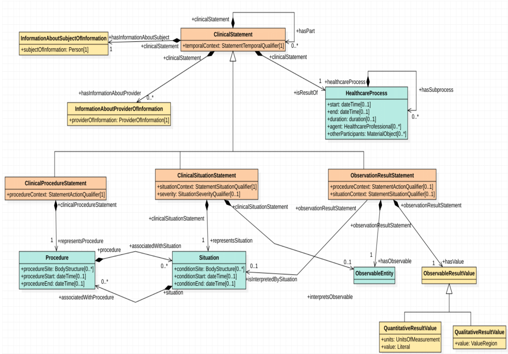
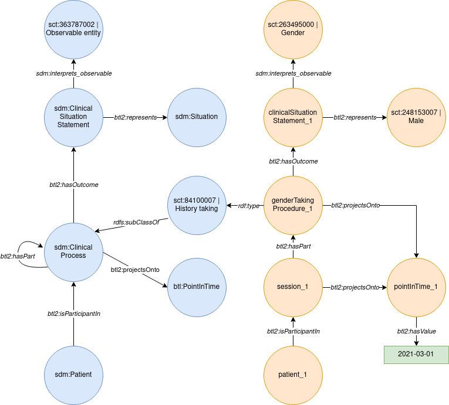
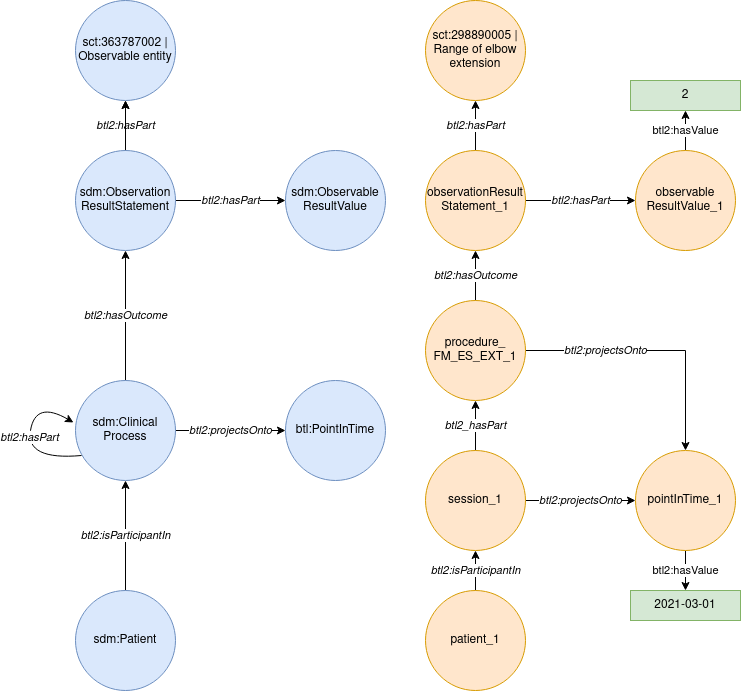
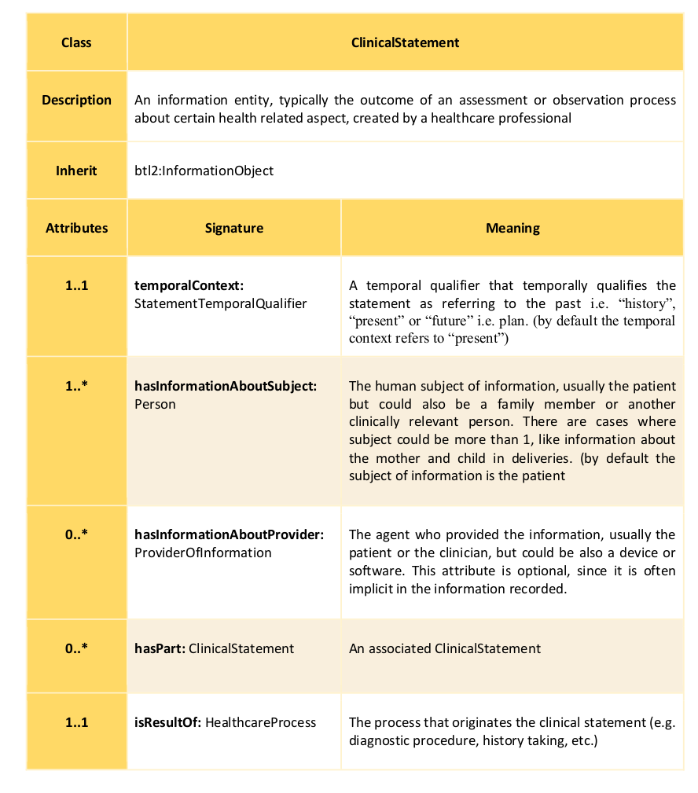
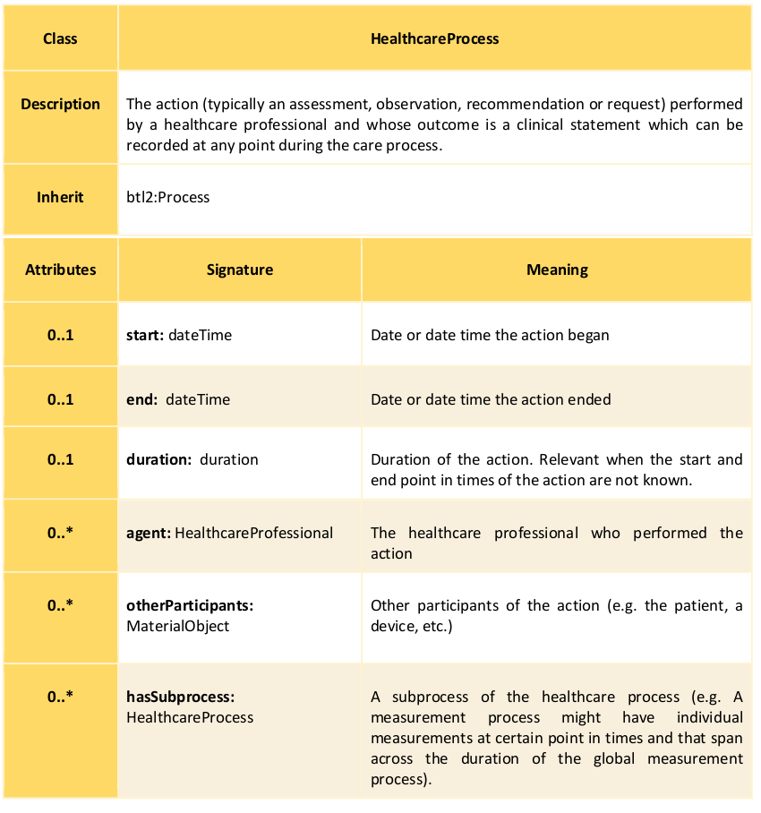
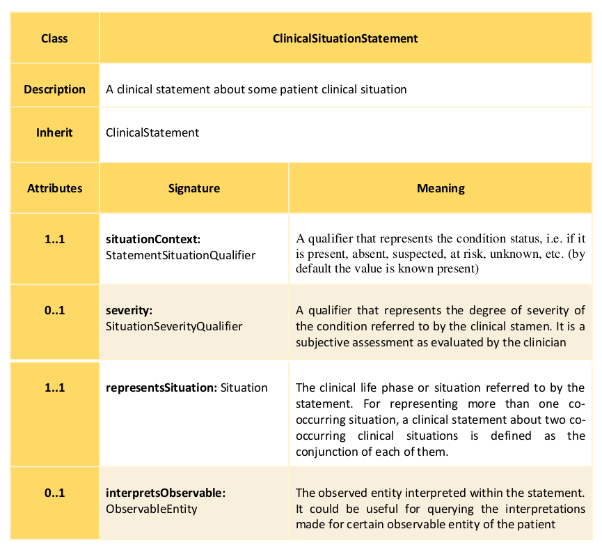
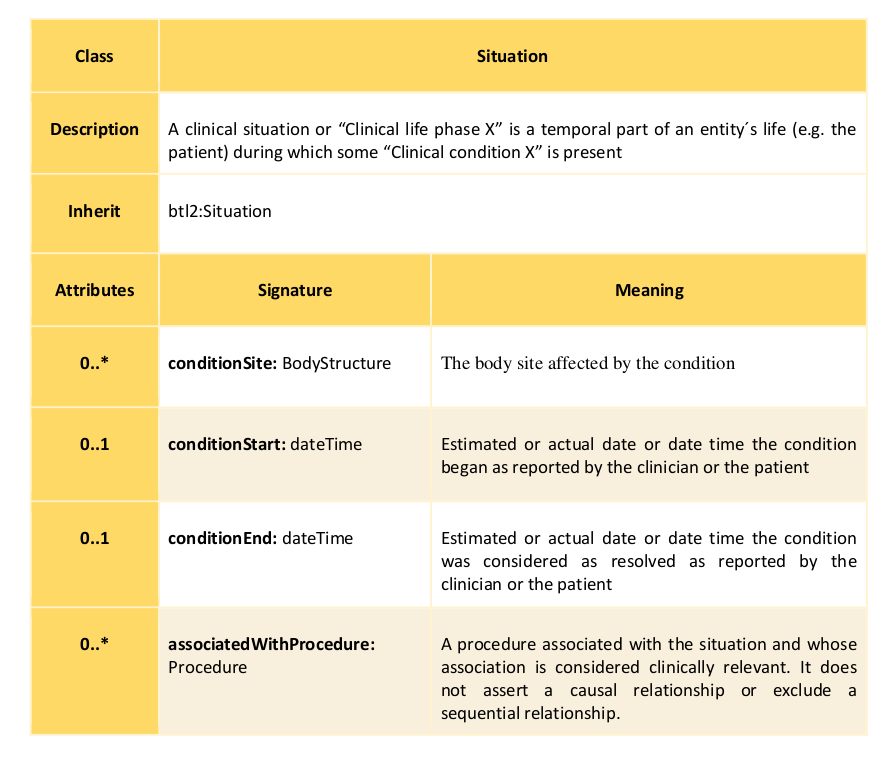
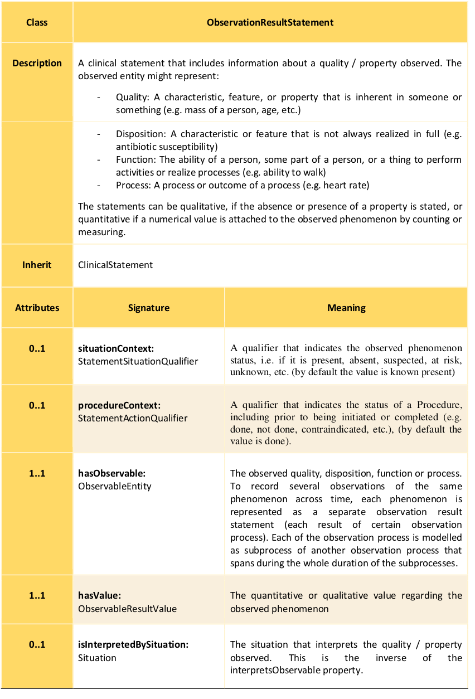

# Semantic Common Data Model

This repository contains the ontologies that conforms the Semantic Common Data Model (SCDM). The SCDM allows representing syntactically and/or semantically heterogeneous data in a harmonized way. Its purpose is twofold: (1) facilitating data transformations between heterogeneous data representations (e.g., having data described using certain proprietary schema and requiring it any other standardized or nor data representation) and (2) target knowledge graph-based data representation for advanced data analysis and exploitation tasks (e.g., applying knowledge graph-based technologies for data analysis and inferencing).

The SCDM extends BTL2 by including concepts for defining informational aspects and integrates them with clinical entities represented by using SNOMED CT as main reference ontology for the medical domain. This requires the alingment of SNOMED CT main concepts and attributes with BTL2.

The focus concept of the information model is the **ClinicalStatement** class, which is specialised by specific subclasses that represent documented medical facts (**ClinicalProcedureStatement**, **ClinicalSituationStatement**, **ObservationResultStatement**). Other classes as the one representing the subject (**InformationAboutSubjectOfInformation**) and the provider of information (**InformationAboutProviderOfInformation**) or the **HealthcareProcess** class provides context to the documented medical facts. The next figure depicts the UML diagram of the current model:

The proposed ontology infrastructure follows the [semantic harmonization principles from Cunningham et al](https://pubmed.ncbi.nlm.nih.gov/28269840/). It uses the axiomatically rich top-level ontology [BTL2](https://biotopontology.github.io/) as reference harmonization framework to allow the unambiguous integration of domain-specific knowledge. The proposed model is agnostic to existing clinical data modelling specifications and includes both information (e.g. temporal context, provenance, etc.) and clinical domain concepts (e.g. 'stroke', 'obesity', etc.).

Next, we show an example of a **ClinicalSituationStatement** representing the gender of a patient by using the SNOMED CT vocabulary. In blue on the left the main classes of the SCDM appear (ClinicalProcess, ClinicalSituationStatement, and Patient), which have been extended with the SNOMED CT vocabulary (84100007 | History taking (procedure) |, 363787002 | Observable entity (observable entity) |). On the right, the instantiation of the data by using the vocabulary provided by the model is shown:

On the other hand, the next figure depicts an example of **ObservationResultStatement**. In this case, we are representing the participation of a patient in the procedure *FM_ES_EXT_1*, which measures the *range of elbow extension*, and whose result is a numerical value (2 in this case).

We distinguish three main types of clinical statements according to the SNOMED CT (SCT) concept category (i.e. Clinical Finding, Procedure and Observable Entity) to which the focus concept belongs.
The focus concept is the main concept of a sentence. Without this concept the sentence is meaningless.

1. Clinical Situation Statement: focus concept is SCT Clinical Finding
2. Clinical Procedure Statement: focus concept is SCT Procedure
3. Observation Result Statement: focus concept is SCT Observable entity

Following, some examples of English sentences that can be represented with each of the previous clinical statements constructs.

1. Clinical Situation Statement: The patient was diagnosed with diabetes mellitus;History of cardiovascular diseases; No pain; Severe headache; Glaucoma in the left eye
2. Clinical Procedure Statement: CT scan planned; History of surgery in the heart; ECG not done; Medication administered 21/3/2019
3. Observation Result Statement: Patient has 90/140 of blood pressure. The glucose level is 90mg/dL.

Next, we show several tables depicting the classes used by the SCDM:

